## AI Outfit Stylist — Shopify App

**AI-powered merchandising engine that automatically generates outfit combinations and allows shoppers to visualize them on realistic avatars — including their own.**

Transforms standard product pages into **visual styling engines** that drive higher revenue and engagement.

---

## Overview

AI Outfit Stylist enhances Shopify product pages by:

- **Increasing AOV**: Automatically builds complete looks that encourage multi-item carts.
- **Improving conversion rate**: Reduces hesitation by letting shoppers see outfits on a model or themselves.
- **Delivering personalization**: Tailors outfits and visuals to each shopper.
- **Upgrading product pages**: From static images to an interactive styling experience.

This is not just a recommendation widget — it is a **visual AI commerce engine**.

---

## Core Capabilities

- **AI Outfit Generation**
  - Builds context-aware outfits from a merchant’s catalog.
  - Uses product attributes and embeddings to find visually coherent combinations.
- **Visual Try-On (2D)**
  - Renders outfits on:
    - **Default AI models** (no friction, no data needed).
    - **Personalized avatars** (opt-in, privacy-focused).
  - Uses **2D generative visualization**, not full 3D try-on (faster, cheaper, safer).
- **Shopify Integration**
  - Embeddable widget on product pages (e.g., “Complete the Look”, “Imagine on Me”).
  - Adds multiple items to cart in a single flow.
- **Cost & Performance Controls**
  - Aggressive caching and reuse of generated images and avatars.
  - Async generation to avoid blocking product page render.

---

## Tech Stack

- **Backend & Hosting**: Railway (app server + background workers).
- **BaaS**: Supabase (Postgres, auth, storage, row-level security).
- **AI**: Gemini (embeddings, outfit reasoning, 2D image generation).
- **Data & Assets**: Supabase storage and CDN in front of generated images.
- **DevOps**: GitHub (source control, CI/CD to Railway).

---

## High-Level Architecture

### Architecture Diagram


### System Flow

Merchant installs app  
↓  
Catalog sync begins  
↓  
AI extracts attributes + embeddings  
↓  
Outfit graph generated  
↓  
Customer views product  
↓  
Outfit widget appears  
↓  
User clicks “Imagine on Me” (optional)  
↓  
Avatar generated (default or personalized)  
↓  
Customer adds multiple items to cart

```mermaid
flowchart TD
  A[Merchant installs app] --> B[Catalog sync begins]
  B --> C[AI extracts attributes and embeddings]
  C --> D[Outfit graph generated]
  D --> E[Customer views product]
  E --> F[Outfit widget appears]
  F --> G[User clicks Imagine on Me (optional)]
  G --> H[Avatar generated - default or personalized]
  H --> I[Customer adds multiple items to cart]
```

### Key Components

- **App Backend**
  - Handles Shopify app install, authentication, and webhooks.
  - Manages product catalog sync and outfit graph generation.
  - Orchestrates image generation requests and caching.
- **Outfit Engine**
  - Maintains product embeddings and outfit relationships.
  - Exposes APIs to fetch suggested outfits for a given product.
- **Visualization Service**
  - Selects/creates avatars.
  - Calls 2D generative models to render outfits on avatars.
  - Stores and serves generated images via CDN.
- **Shopper Avatar Store**
  - Secure, minimal storage of shopper avatar preferences and metadata.
  - Links anonymized shopper tokens to avatar records.
- **Frontend Widget**
  - Embeddable UI on product pages.
  - Triggers outfit selection, visualization, and add-to-cart.

---

## Installation & Setup (High-Level)

> Exact stack (Node/Remix, Ruby on Rails, etc.) is implementation-specific. This section focuses on conceptual steps.
> This implementation assumes **Supabase**, **Gemini**, **Railway**, and **GitHub** as the primary platform choices.

- **1. Create Shopify App**
  - Set up an embedded app with OAuth.
  - Request scopes for reading products, collections, and orders (for analytics).
- **2. Catalog Sync**
  - Subscribe to product and collection webhooks.
  - Maintain a local product index for outfit generation.
- **3. Theme / App Extension**
  - Add a product page widget (theme app extension or ScriptTag-style injection).
  - Ensure the widget can:
    - Read the current product.
    - Call backend APIs for outfits and visualizations.
    - Add selected items to cart.
- **4. Storage**
  - Configure:
    - Database for outfits, avatars, and usage.
    - Object storage/CDN for generated images.
- **5. AI / Image Provider**
  - Connect to your chosen generative image provider (diffusion model, hosted API, etc.).
  - Implement prompt templates and safety filters.

---

## Merchant Onboarding & Catalog Scan

After install, the app should **immediately show value** to the merchant.

- Show a clear status message such as:  
  **“Scanning your catalog — AI stylist ready in ~8 minutes.”**
- This reassures merchants that:
  - The app is working.
  - Value is coming soon.
  - They don’t need to configure everything manually.

### Sequence: Install → Catalog Scan → Ready

```mermaid
sequenceDiagram
  participant Merchant
  participant Shopify
  participant Backend as App Backend (Railway)
  participant DB as Supabase (DB/Storage)
  participant AI as Gemini (AI)

  Merchant->>Shopify: Install AI Outfit Stylist app
  Shopify->>Backend: OAuth callback + shop details
  Backend->>DB: Create shop record
  Backend-->>Merchant: "Scanning your catalog — AI stylist ready in ~8 minutes."

  Backend->>Shopify: Fetch products in batches
  Shopify-->>Backend: Product data

  Backend->>AI: Generate embeddings + outfit suggestions
  AI-->>Backend: Outfit graph / embeddings

  Backend->>DB: Store products, outfits, avatar defaults
  Merchant-->>Backend: Open app dashboard
  Backend-->>Merchant: Show progress + "AI stylist ready" when complete
```



---

## Shopper Experience

### Default Experience (Frictionless)

1. Shopper views a product.  
2. Widget shows **“Complete the Look”** and/or **“See it on a model”**.  
3. When clicked, shopper sees the outfit on a **default AI model**:
   - Gender-matched.
   - Optional body-type presets:
     - Slim
     - Athletic
     - Plus
     - Regular
4. Shopper can add multiple items (entire outfit) to cart.

This should be the **default, zero-friction** experience.

#### Flow Diagram: Default Shopper Journey

```mermaid
flowchart TD
  A[Shopper views product page] --> B[Widget loads - outfit widget]
  B -->|Clicks "See it on a model"| C[Request outfit + default avatar from backend]
  C --> D{Outfit + image cached?}
  D -->|Yes| E[Render outfit image on default model]
  D -->|No| F[Show fallback/default state and trigger async generation]
  F --> G[Backend generates image via Gemini and stores in Supabase/CDN]
  G --> E
  E --> H[Shopper selects items from outfit]
  H --> I[Add multiple items to Shopify cart]
  I --> J[Checkout in Shopify]
```

### Personalized Experience (“Imagine On Me”)

1. Shopper clicks **“Imagine on Me”**.  
2. A quick onboarding modal appears (target: **< 20 seconds**):
   - Optional selfie upload.
   - Height.
   - Weight.
   - Body shape.
   - Skin tone.
   - Gender.
   - Optional fit preference (oversized / tailored).
3. Avatar is generated and stored securely.
4. Future outfits render on this avatar automatically.

#### Sequence: “Imagine On Me” Request


---

## Avatar Modes

### 1️⃣ Default Mode (MVP / Safe Mode)

Used when the shopper has **not** provided personal data:

- Show the outfit on an AI-generated model.
- Automatically match gender.
- Optionally allow shopper to choose a rough body-type preset.
- Avatar library is **controlled and consistent**:
  - Gender.
  - Broad ethnicity range.
  - Body type.
  - Fixed, commerce-friendly poses.

**Why this matters:**

- Zero onboarding friction.
- Fast, reliable visuals.
- Consistent brand feel.

This is the **first mode you should ship**.

### 2️⃣ Personalized Mode

Activated only when a shopper **explicitly opts in** by providing data/selfie:

- Data should be **minimal and purposeful**.
- Use anonymized tokens instead of direct identifiers where possible.
- Make it easy to:
  - Delete the avatar.
  - Opt out of personalization later.

---

## Visualization Architecture

### Strategy

- **Do NOT start with 3D try-on.**
  - 3D is expensive, slow to ship, and deep-tech heavy.
- Start with **2D generative outfit visualization**:
  - Faster to iterate.
  - Much cheaper to run.
  - Good enough for most fashion commerce use cases.

### Pipeline

Outfit selected  
↓  
Base avatar chosen  
↓  
Garment(s) layered / rendered via AI  
↓  
Final composite generated and cached

### Technical Paths

- **Path A — Diffusion-Based Generation**
  - Prompt-based generation of a model wearing the outfit.
  - **Pros**: Flexible, high realism.  
  - **Cons**: Requires careful prompt design, style control, and safety checks.

- **Path B — Garment Overlay (Later Optimization)**
  - Segment garments from product images and overlay them onto avatars.
  - **Pros**: More deterministic, higher SKU fidelity.  
  - **Cons**: More complex segmentation + compositing pipeline.

Start with **Path A**, then evolve toward Path B as the product matures.

---

## Prompt Design Guidelines

Avoid vague prompts like:

> Person wearing stylish outfit

Prefer **structured, deterministic** prompts using model and outfit attributes:

> Generate a realistic ecommerce fashion photo.  
>  
> Model attributes:  
> - gender: female  
> - body type: athletic  
> - skin tone: medium  
>  
> Outfit:  
> - white oversized shirt  
> - beige trousers  
> - white sneakers  
>  
> Pose: standing, neutral background, studio lighting

**Consistency > creativity.** The goal is commercial clarity, not art experimentation.

---

## Data Model: Shopper Avatars

Recommended table: `shopper_avatars`

| Field         | Type      | Notes                                     |
|--------------|-----------|-------------------------------------------|
| id           | uuid      | Primary key                               |
| shop_id      | uuid      | Shopify shop reference                    |
| shopper_token| text      | Anonymized shopper token (non-PII)        |
| height       | numeric   | Optional                                  |
| weight       | numeric   | Optional                                  |
| body_shape   | text      | e.g., slim / athletic / plus / regular    |
| skin_tone    | text      | Normalized categories                     |
| gender       | text      | Shopper self-identification               |
| selfie_url   | text      | Storage URL (if selfie is used)          |
| created_at   | timestamp | Creation time                             |

**Important:**  
Use **anonymized shopper tokens**. Avoid storing direct PII (name, email, etc.) whenever possible.

---

## Privacy & Compliance

This feature touches **sensitive visual and profile data**. Treat it with caution.

### Must Do

- **Explicit consent**:
  - Clear explanation of what’s generated and stored.
  - Checkbox or equivalent explicit opt-in for personalized avatars.
- **Easy deletion**:
  - Provide a clear way to delete avatars and related data.
- **Data minimization**:
  - Only store what’s required for avatar rendering.
  - Prefer anonymous or pseudonymous identifiers.
- **Transparent AI usage**:
  - Clearly state that images are AI-generated visualizations.

### Avoid

- Face recognition or identity inference.
- Biometric or medical claims based on body shape or image.
- Implying exact sizing/fit guarantees from visuals.

Position the feature as **visual personalization**, not biometric analysis.

---

## When NOT to Generate Images

To protect UX, costs, and brand trust, **skip or defer generation** when:

- The product has **no clean, high-quality image**.
- Outfit confidence is low (weak recommendations, low compatibility score).
- Garments **visually clash** in style, color, or category.
- The generation **queue is overloaded** or GPU resources are constrained.

In these cases:

- Fallback to:
  - Default static product imagery, or
  - A simple, non-AI “Complete the Look” layout without generated avatars.
- Never show **broken, obviously incorrect, or low-quality AI**.

---

## Cost Control Strategy

Image generation can become the **largest variable expense**. Design for cost control from day one.

- **Generate once, cache forever**
  - For a given outfit + avatar configuration, generate a single image and reuse it.
- **Reuse avatars**
  - Shopper avatars should be generated sparingly and reused across sessions and outfits.
- **Pre-generate popular outfits**
  - Precompute for:
    - Bestsellers.
    - Top traffic product pages.
    - High-conversion outfits.
- **Async rendering**
  - Do not generate on every page load.
  - Use background jobs and queues.
  - Show a default image first, then upgrade when ready.

---

## Performance Strategy

Performance is a **core product feature** for ecommerce.

- **Never block product page rendering**
  - The core product page should load normally even if the widget or images are not ready.
- **Widget behavior**
  - If generated image exists → show instantly.
  - If not:
    - Show default model or skeleton state.
    - Trigger async generation in the background.
- **Image optimizations**
  - Use responsive images, compression, and CDN distribution.
  - Prefer standard ecommerce aspect ratios and sizes.

Speed → better conversions → happier merchants.

---

## Development Roadmap

### Phases 0–7 (Pre-Avatar)

Earlier phases (core app, outfit engine, analytics, etc.) remain unchanged.  
The avatar system is a **layer on top of a working revenue engine**, not the foundation.

### Phase 8 — Default Model Visualization (High ROI)

**Goal:** Add visual selling power without heavy complexity.

- Build:
  - Avatar template library (controlled set of default models).
  - Outfit image generator (for default avatars).
  - CDN storage and caching strategy.
  - Widget toggle: **“See it on a model”**.

Shipping this alone can significantly boost conversions and perceived app value.

### Phase 9 — Shopper Avatar System

**Goal:** Personalization layer on top of default visuals.

- Build:
  - Shopper onboarding modal.
  - Secure avatar storage and retrieval.
  - Personalized generation pipeline.
  - Avatar reuse logic across sessions and outfits.

Start simple; avoid perfectionism in v1.

### Phase 10 — Optimization

- Cache aggressively at every layer.
- Pre-generate top outfits and avatars.
- Compress and version images.
- Implement robust generation queues and backpressure.

The goal is to protect margins while scaling usage.

---

## MVP Guardrails

**Do NOT launch with full “Imagine On Me” personalization first.**

Recommended launch sequence:

1. AI outfit generation.  
2. Product page widget.  
3. Revenue tracking and analytics.  
4. Default model visualization.  
5. Shopper avatars and personalization.

Founders who invert this typically burn months on complex avatar tech before proving revenue impact.

---

## Strategic Positioning

Most Shopify stores still lack strong visual storytelling for outfits.

By adding this app, merchants:

- Upgrade from static product images to **interactive, AI-powered visuals**.
- Move beyond commodity “customers also bought” widgets.
- Enter the space of **next-generation visual commerce tools**.

Long-term, the moat becomes:

👉 **Visual commerce intelligence** — understanding what *looks* and *styles* actually convert.

---

## Principles & Philosophy

- **First become a revenue engine. Then become a visual engine.**
- **Speed > perfection**:
  - Ship the simplest valuable version first.
- **Learning > architecture**:
  - Optimize based on real merchant and shopper behavior.
- **Adoption > features**:
  - Focus on making setup easy and value obvious.

You are building a foundational layer for **AI-native commerce**, not just another widget.

